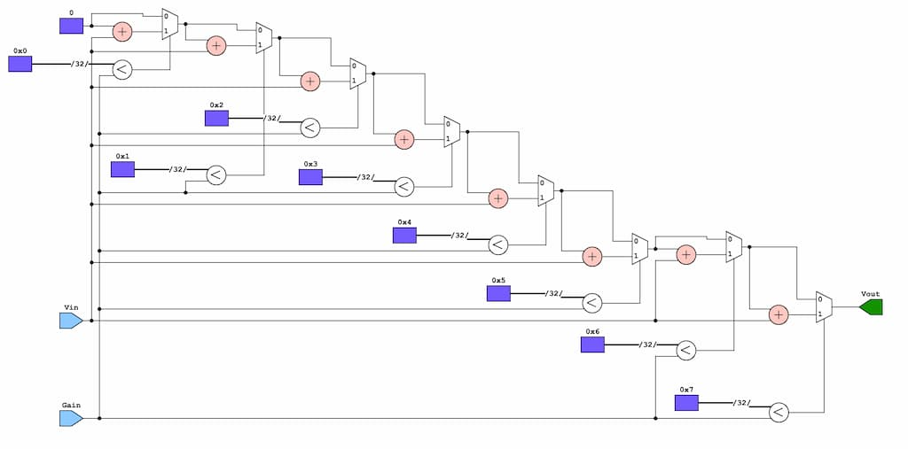
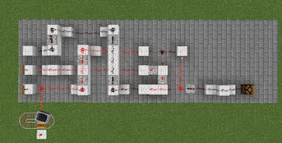

In my quest to make verilog models out of a multitude of different SSI and MSI semiconductor products, I have now gotten to the operational amplifier. My primary inspiration for this design is the OPA4H199-SP from Texas Instruments. First I started with the basic function of an opamp which is the amplification of a signal by multiplying the voltage by the gain. 

``` verilog
module OpAmp(
    input wire [x:0] Vin,
    output wire [x:0] Vout,
    input wire [x:0] Gain
);

    assign Vout = Gain * Vin;

endmodule
```

[^1]

[^1]: I chose to represent an arbitrary amount of bits with variable x. I was not sure how large the buses needed to be in designing this first simplest model, so I decided to leave it up to my later discretion.  

This is an _ideal_ and _general_ opamp that has no resistance, slew, feedback, or added complexity to achieve specific results. During creation I asked myself whether I wanted an opamp that would be created in perfect immitation of the real deal or one which is the _perfect abstract model_. I settled upon the latter, as immitating real world constraints with test benches and design features was not my goal in creating the verilog opamp. 

We have to consider, then, ideal variables for the opamp as to create the _perfect abstract model_ as I have discussed. Finding the characteristics and specifications turned out to be easier than I thought thanks to documentation from many different power semiconductor manufacturers like [Texas Instruments](https://www.ti.com.cn/cn/lit/an/slaa068b/slaa068b.pdf) and [Toshiba](https://toshiba.semicon-storage.com/us/semiconductor/knowledge/faq/linear_opamp/what-is-the-ideal-op-amp.html), along with my very own [University of Kansas](https://www.google.com/url?sa=t&source=web&rct=j&opi=89978449&url=http://www.ittc.ku.edu/~jstiles/412/handouts/2.1%2520The%2520ideal%2520op-amp/The%2520Ideal%2520Operational%2520Amplifier%2520lecture.pdf&ved=2ahUKEwihno_t1omLAxXgHzQIHSn5FbgQFnoECA4QAQ&usg=AOvVaw190cbAOtlScLv1mi2fzOeu).

In order to get closer to the real silicon in my design abstraction, I shall remove the * multiplication operator and replace it with an always loop which takes a particularly inneficient but easy to design in terms of understanding. Essentially working as any formulaic loop, it takes an iterative variable i, and compares it to the maximum gain outlined as a constant parameter. If i is less than the maximum gain, the output voltage is increased by the input voltage, and this is repeated until i reaches its threshold of eight iterations, essentially replicating multiplication through brute force addition.

``` verilog
module OpAmp(
    input wire Vin, 
    input wire Gain,  
    output reg Vout  
);

    parameter GAINMAX = 8; 
    integer i;               

    always @(*) begin
        Vout = 0; 
        for (i = 0; i < MAX_GAIN; i = i + 1) begin
            if (i < Gain)  
                Vout = Vout + Vin;
        end
    end

endmodule
```


The [yosys](https://github.com/YosysHQ/yosys) digital logic diagram is given below:



The iterative variables are given by the memory blocks 0x0-7, with the multiplexer selectors being the comparison 0xA $$<$$ Gain (A representing any value 0-7). The initial 0 mux input is 0, with each following mux 0 input being the output of the previous mux. The initial 1 mux input is the addition of the iterative variable and the input voltage. The final product that goes to the output voltage register being the last mux output


Of course, we could not create a verilog circuit if we didn't also model it with minecraft redstone as well. With the ability to do this being none of my own but due to the help of the amazing [MinecraftHDL](https://github.com/itsfrank/MinecraftHDL) project.



[Back](../indexblog.md)

